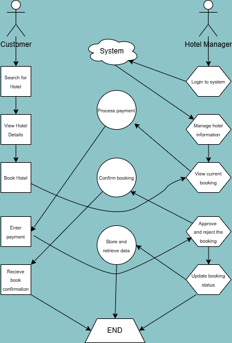

# Requirement Analysis in Software Development  

## Introduction  

This repository is dedicated to understanding and documenting the foundational phase of software development: **Requirement Analysis**. It explores how to gather, analyze, and prioritize requirements to ensure the successful implementation of a software project. By providing structured documentation, design planning, and role definitions, this repository serves as a guide for teams to build scalable and user-centric applications efficiently.  

The resources here will help developers, designers, and stakeholders align on the project goals, define key features, and establish a roadmap for development while adhering to industry best practices.  

## Why is Requirement Analysis Important?  

Requirement Analysis is a cornerstone of successful software development. It ensures that the software being developed aligns with user needs, business goals, and technical feasibility. Below are three key reasons why Requirement Analysis is critical in the Software Development Lifecycle (SDLC):  

1. **Prevents Scope Creep**  
   - By clearly defining and documenting the requirements upfront, Requirement Analysis helps to set boundaries for the project.  
   - This minimizes the risk of unplanned changes or additions that can lead to increased costs, delays, and project inefficiencies.  

2. **Enhances Communication Among Stakeholders**  
   - Requirement Analysis provides a shared understanding of the project goals and expectations.  
   - It bridges the gap between technical teams, business stakeholders, and end-users, ensuring everyone is aligned on the objectives and deliverables.  

3. **Improves Project Quality and Success Rate**  
   - Well-analyzed requirements form the basis for effective design, development, and testing.  
   - This ensures that the final product meets user needs, reduces the likelihood of defects, and increases overall project success.  

By investing time and effort into Requirement Analysis, software projects can avoid common pitfalls, deliver value to users, and meet business objectives effectively.  

## Key Activities in Requirement Analysis  

Requirement Analysis involves several critical activities that help define and refine the needs of a software project. Below are the five key activities:  

- **Requirement Gathering**  
  - Collect initial information from stakeholders, including business objectives and user needs.  
  - Use interviews, surveys, and brainstorming sessions to ensure all perspectives are captured.  

- **Requirement Elicitation**  
  - Dive deeper into understanding stakeholder expectations and uncover hidden requirements.  
  - Techniques include workshops, focus groups, and prototyping to clarify ambiguities.  

- **Requirement Documentation**  
  - Organize the gathered requirements into clear, structured formats such as use cases, user stories, or requirement specifications.  
  - Ensure the documentation is accessible and understandable to all stakeholders.  

- **Requirement Analysis and Modeling**  
  - Evaluate the documented requirements for feasibility, consistency, and completeness.  
  - Use visual tools like flowcharts, data models, and mockups to represent complex requirements.  

- **Requirement Validation**  
  - Confirm with stakeholders that the documented requirements accurately reflect their needs.  
  - Validate requirements for technical feasibility, business alignment, and clarity.  

These activities are essential for creating a shared understanding of the project goals and ensuring a solid foundation for design and development.  

## Types of Requirements  

In software development, requirements are categorized into two main types: Functional Requirements and Non-functional Requirements. These requirements define the system's behavior and quality, ensuring the application meets both user expectations and technical standards. Below are the definitions and examples based on the case study of a hotel booking management project.  

### Functional Requirements  
Functional Requirements describe the specific behaviors or functions of a system. They define what the system should do to fulfill user needs and achieve its objectives.  

Examples for the hotel booking application:  
- **Hotel Management Service**:  
  - Allow hotel managers to update hotel details (e.g., name, location, pricing, and availability).  
  - Sync updated data to the master and slave databases.  
- **Customer Service (Search + Booking)**:  
  - Enable users to search hotels by location, price, and availability.  
  - Facilitate hotel booking and interaction with third-party payment services.  
- **View Booking Service**:  
  - Display current and past bookings for customers and hotel managers.  

### Non-functional Requirements  
Non-functional Requirements define the quality attributes or constraints of a system. They focus on how the system performs its functions rather than the specific tasks.  

Examples for the hotel booking application:  
- **Performance**:  
  - Ensure API response times are under 1 second using Redis for caching and Elasticsearch for search functionality.  
- **Scalability**:  
  - Utilize microservices architecture to manage high user traffic and ensure the system can scale effectively.  
- **Reliability**:  
  - Implement a master-slave database architecture to reduce database load and ensure data consistency.  
- **Security**:  
  - Secure customer and manager portals with robust authentication mechanisms.  
- **Availability**:  
  - Use Content Delivery Networks (CDNs) to provide uninterrupted service and minimize downtime.  

By addressing both Functional and Non-functional Requirements, the system can deliver a seamless and reliable booking experience for users while meeting performance and scalability expectations.  

## Use Case Diagrams  

Use Case Diagrams are visual representations that illustrate the interactions between users (actors) and the system, highlighting the functional requirements of a project. They are an essential tool in software development for identifying and documenting system functionality.  

### Benefits of Use Case Diagrams  
- **Clarity**: Simplifies understanding of how the system will be used by different actors.  
- **Requirement Validation**: Ensures all stakeholder needs are accounted for in the system's design.  
- **Collaboration**: Provides a shared understanding for developers, designers, and stakeholders.  
- **System Scope Definition**: Clearly defines system boundaries and interactions.  

### Use Case Diagram for Booking System  

Below is the use case diagram for the hotel booking management system. It includes actors such as *Hotel Manager*, *Customer*, and *System Administrator*, and shows their interactions with various use cases like *Manage Hotels*, *Search for Hotels*, *Book Hotel*, *Process Payments*, and *View Bookings*.  

  

## Acceptance Criteria  

### Importance of Acceptance Criteria  
Acceptance Criteria are critical in Requirement Analysis as they establish clear conditions that a feature or system must meet to be considered complete. They ensure alignment between stakeholders, developers, and testers, providing a shared understanding of the expected outcomes. By minimizing ambiguities, Acceptance Criteria improve communication, reduce rework, and help deliver a product that meets user and business needs effectively.  

### Example: Acceptance Criteria for the Checkout Feature  

#### **Scenario 1: Successful Property Booking**  
- **Given:** A user selects a property and navigates to the checkout page.  
- **When:** The user inputs valid booking details (dates, number of guests, and payment information).  
- **Then:** The system processes the payment, confirms the booking, and displays a success message with booking details.  

#### **Scenario 2: Invalid Payment Information**  
- **Given:** A user attempts to book a property.  
- **When:** The payment details provided are invalid.  
- **Then:** The system rejects the payment, displays an error message, and prompts the user to re-enter valid information.  

#### **Scenario 3: Booking Availability Check**  
- **Given:** A user enters booking details.  
- **When:** The selected dates are unavailable.  
- **Then:** The system notifies the user of unavailability and suggests alternative dates or properties.  

By defining such clear and measurable criteria, stakeholders can ensure that the Checkout feature functions as intended and delivers a seamless user experience.  
